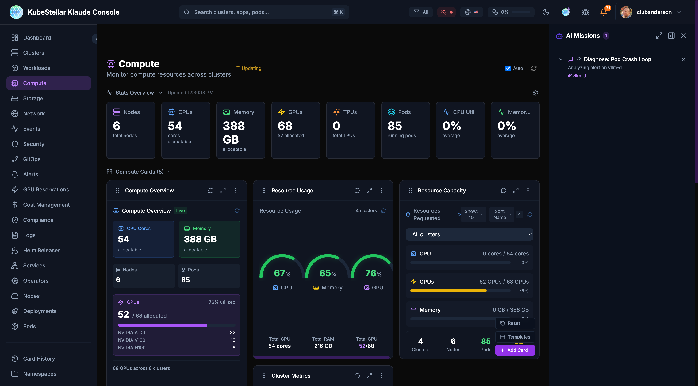

# AI Features

KubeStellar Console uses AI to help you manage your clusters. Think of it as having a helpful assistant who knows Kubernetes.



---

## AI Missions

AI Missions are conversations with AI to solve problems. Click the mission button in the bottom right to start.

### What Can You Do?

| Mission Type | What it does |
|--------------|--------------|
| **Troubleshoot** | Find out why something is broken |
| **Analyze** | Understand what's happening |
| **Repair** | Fix problems automatically |
| **Upgrade** | Plan and execute upgrades |
| **Deploy** | Help deploy applications |

### How It Works

1. Click **"AI Missions"** button (bottom right)
2. Choose a mission type or describe your problem
3. AI asks questions to understand the issue
4. AI runs commands and analyzes results
5. AI suggests fixes or takes action
6. You approve or reject the suggestions

### Example: Troubleshooting a Crash

**You:** "Why is my nginx pod crashing?"

**AI:** "Let me check. I found the pod `nginx-abc123` in namespace `default` is in CrashLoopBackOff. Looking at the logs...

The container is failing because it can't bind to port 80. There's already a process using that port.

**Suggestion:** Change the container port to 8080 or remove the conflicting service."

### Mission Panel Features

- **Full screen** - Expand for more space
- **Minimize** - Hide while AI works
- **Collapse** - Show just the title
- **Multiple missions** - Run several at once
- **Token tracking** - See how many tokens used

---

## AI Diagnose

Every card has an "Ask AI" button. Click it to get AI analysis of that specific data.

### How to Use

1. Look at any card
2. Click the **AI icon** (brain/sparkle)
3. AI analyzes the card data
4. Get insights and suggestions

### What AI Can Tell You

- Why metrics look unusual
- What's causing issues
- How to fix problems
- What to watch out for
- Historical context

### Example

**Card:** Cluster Health showing 2 clusters offline

**AI:** "I see 2 clusters are offline. Let me check...

- `cluster-1`: Network timeout - likely a firewall issue
- `cluster-2`: Certificate expired 2 hours ago

**Suggestions:**
1. Check VPN connection for cluster-1
2. Renew certificate for cluster-2 with `kubectl certificate approve`"

---

## AI Repair

When AI diagnoses a problem, it can often fix it automatically.

### How Repair Works

1. AI identifies the problem
2. AI creates a fix
3. You review the fix
4. You approve or reject
5. AI applies the fix

### Safety First

- AI **always asks** before making changes
- You see exactly what will change
- You can reject any action
- Changes are logged

### What AI Can Repair

- **Pod issues** - Restart stuck pods, fix resource limits
- **Certificate problems** - Approve pending certificates
- **Configuration errors** - Fix ConfigMaps and Secrets
- **Scaling issues** - Adjust replica counts
- **Resource quotas** - Suggest adjustments

---

## Smart Suggestions

AI watches how you use the console and suggests improvements.

### Card Swap Suggestions

When AI notices you're focusing on different things:

1. AI detects focus change
2. Shows a suggestion with countdown
3. You can:
   - **Accept** - Swap to the new card
   - **Snooze** - Hide for 1 hour
   - **Keep** - Stay with current card
   - **Cancel** - Dismiss suggestion

### What Triggers Suggestions?

- Spending time on a specific card
- Clicking into details repeatedly
- Issues appearing in your clusters
- Changes in cluster state

### Example

*You've been looking at pod issues for 5 minutes*

**AI Suggestion:** "I notice you're focused on pod issues. Would you like to swap the Cluster Metrics card for a Pod Health Trend card?"

---

## AI Card Creation

You can create brand new cards just by describing what you want. This is the Card Factory feature.

### How to Create a Card with AI

1. Open the **Card Factory** (from the add card menu)
2. Choose **"Describe with AI"**
3. Type what you want in plain English
4. AI builds the card
5. Preview it and add to your dashboard

### Example

**You type:** "Show me a card that displays the top 5 pods by memory usage with a bar chart"

**AI creates:** A custom bar chart card showing your top pods ranked by memory, updating in real time.

### What You Can Create

- Custom metric views for your specific needs
- Charts and tables with your own filters
- Cards that combine data from multiple sources
- Specialized views for your team's workflow

### Other Ways to Create Cards

If you prefer code, the Card Factory also accepts:
- **JSON definitions** - Declarative card configuration
- **TSX code** - Full React components (compiled at runtime)

---

## Provider Health Monitoring

The Provider Health card shows you the status of AI services and cloud providers your console depends on.

### What It Shows

- **Claude** (Anthropic) - Status and availability
- **OpenAI** - Status and availability
- **Gemini** (Google) - Status and availability
- **Cloud providers** - AWS, Azure, GCP status

### Why It Matters

If AI features stop working or respond slowly, check the Provider Health card first. It tells you whether the issue is on your side or the provider's side.

---

## AI Mode Levels

Control how much AI assistance you get:

### Low Mode (~10% tokens)

- AI only responds when you ask
- Direct kubectl commands
- Best for: Cost control

### Medium Mode (~50% tokens)

- AI analyzes on request
- Summaries and insights
- Best for: Balanced usage

### High Mode (~100% tokens)

- Proactive suggestions
- Auto-analysis of issues
- Card swap recommendations
- Best for: Maximum assistance

### Changing AI Mode

1. Go to **Settings** (`/settings`)
2. Find "AI Mode"
3. Select your preferred level
4. Changes apply immediately

---

## Token Usage

AI features use tokens, which may have costs. The console tracks usage.

### Viewing Token Usage

- **Header bar** - Shows percentage used
- **Settings page** - Detailed breakdown
- **Mission panel** - Per-mission tracking

### Token Limits

You can set limits to control costs:

```yaml
ai:
  tokenLimits:
    enabled: true
    monthlyLimit: 100000
    warningThreshold: 80   # Warn at 80%
    criticalThreshold: 95  # Restrict at 95%
```

When you hit the warning threshold, you'll see a notification. At the critical threshold, some AI features are restricted.

### Tips for Saving Tokens

- Use Low or Medium mode for routine work
- Switch to High mode only when troubleshooting
- Use direct kubectl for simple queries
- Review mission history to avoid duplicates

---

## Privacy & Safety

### What AI Sees

- Cluster names and namespaces
- Pod and deployment names
- Resource metrics
- Event messages
- Log snippets (when you share them)

### What AI Doesn't See

- Your kubeconfig credentials
- Secrets or sensitive data
- Personal information
- Data from other users

### Data Handling

- AI analysis happens through Anthropic's API
- According to Anthropic's data usage policy, data sent via their API is not used to train Anthropic models by default. For details, see [Anthropic's privacy and data usage documentation](https://www.anthropic.com/legal/privacy).
- Conversations are stored locally
- You can delete mission history anytime
