# Dashboards

KubeStellar Console has 27+ different dashboards. Each one shows you different information about your Kubernetes clusters.

## Main Dashboard

**Route:** `/`

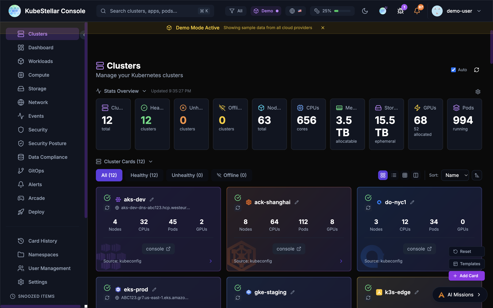

This is your home page. It shows:
- Overview of all your clusters
- Cards you've chosen to see
- Quick stats at the top
- AI suggestions for what to look at

The main dashboard learns what you care about and shows those things first.

---

## Dedicated Dashboards (27)

### Clusters Dashboard

**Route:** `/clusters`

See all your Kubernetes clusters:
- Which clusters are healthy (green)
- Which clusters have problems (red)
- Which clusters are offline (gray)
- Quick links to each cluster's native console

**Best for:** Checking if all your clusters are working

---

### Workloads Dashboard

**Route:** `/workloads`

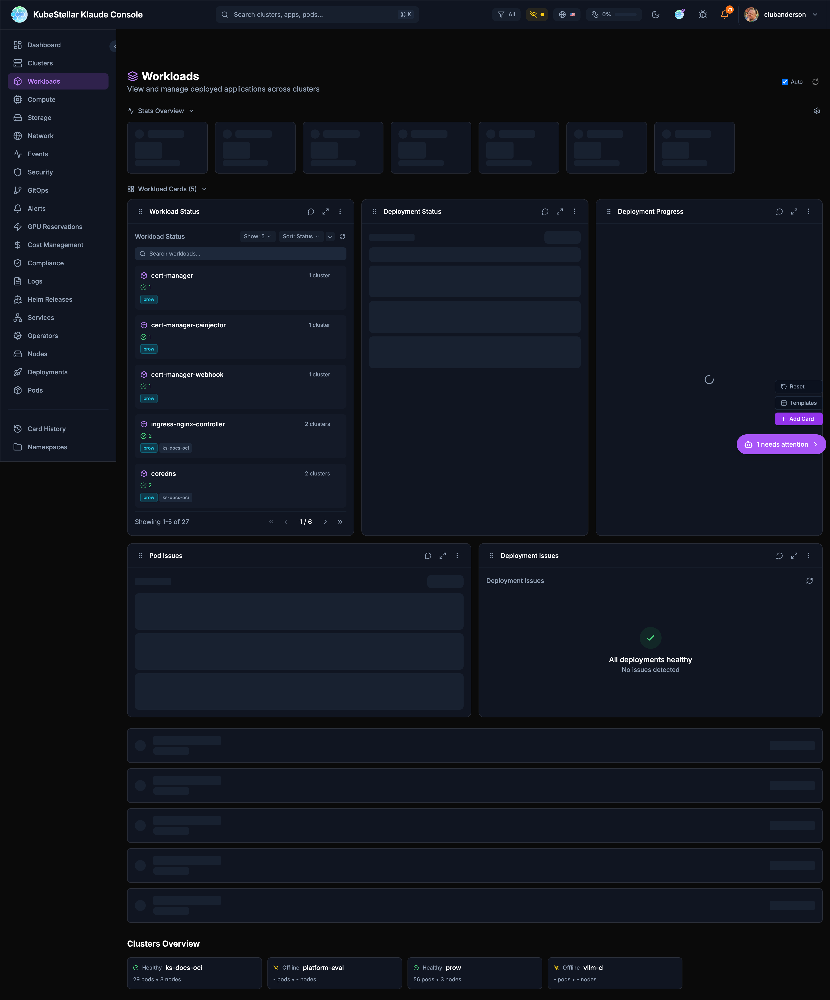

See all your running applications:
- Deployments and their status
- Pods that are having problems
- Which apps are healthy

**Best for:** Making sure your applications are running

---

### Compute Dashboard

**Route:** `/compute`

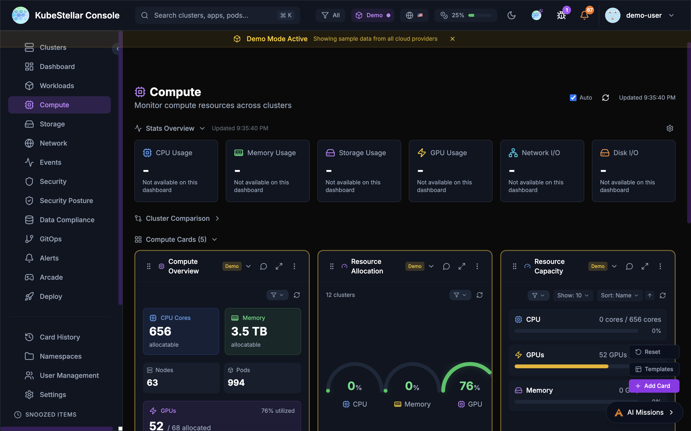

See your compute resources:
- How many CPUs you have
- How much memory is available
- GPU usage (important for AI workloads!)
- Top pods using resources

**Best for:** Checking if you have enough resources

---

### Storage Dashboard

**Route:** `/storage`

See your storage:
- Persistent Volume Claims (PVCs)
- Storage classes
- Which volumes are bound or pending

**Best for:** Managing disk space for your apps

---

### Network Dashboard

**Route:** `/network`

See your networking:
- Services and their types
- LoadBalancers
- Ingresses
- Endpoints

**Best for:** Understanding how traffic flows

---

### Events Dashboard

**Route:** `/events`

See what's happening:
- Recent events from all clusters
- Warnings that need attention
- Normal events
- Filter by time or type

**Best for:** Troubleshooting when something goes wrong

---

### Security Dashboard

**Route:** `/security`

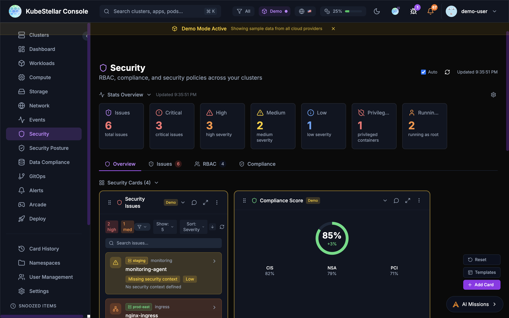

Find security issues:
- Containers running as root
- Privileged containers
- Missing security contexts
- Critical and high severity issues

**Best for:** Keeping your clusters secure

---

### GitOps Dashboard

**Route:** `/gitops`

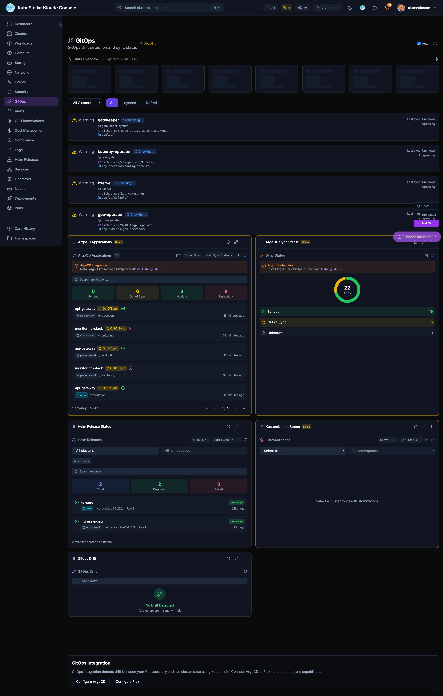

Manage GitOps:
- Helm releases and their status
- Kustomizations
- ArgoCD applications
- Drift detection (when clusters don't match git)

**Best for:** Managing deployments from git

---

### Alerts Dashboard

**Route:** `/alerts`

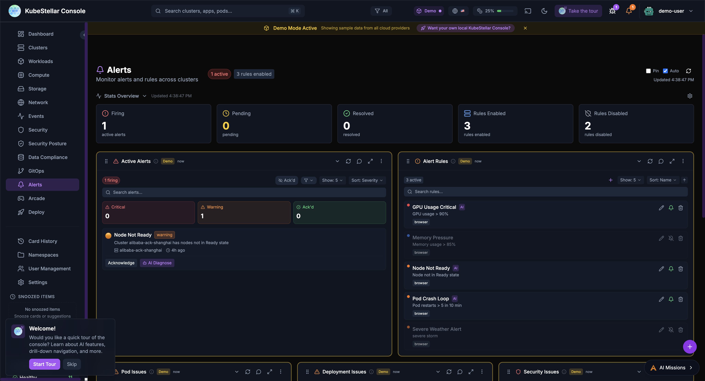

Manage alerts:
- Firing alerts
- Pending alerts
- Alert rules you've created
- Resolved alerts

**Best for:** Knowing when things need attention

---

### GPU Reservations Dashboard

**Route:** `/gpu-reservations`

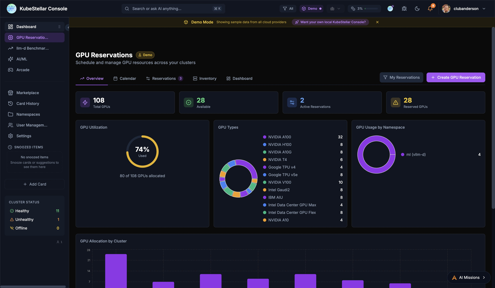

Schedule and manage GPU resources across your clusters with five dedicated tabs:

- **Overview**: Total GPUs, availability, utilization donut chart, GPU types breakdown, allocation by cluster
- **Calendar**: Visual calendar view of GPU reservations and availability windows
- **Reservations**: Active and pending GPU reservations with details
- **Inventory**: Full GPU inventory across all clusters with type, count, and status
- **Dashboard**: Customizable card-based view of GPU metrics

Key features:
- Create GPU reservations with namespace, cluster, and time range
- View GPU usage by namespace with donut chart breakdowns
- Track 12+ GPU types: NVIDIA A100/H100/A10G/V100/T4, Google TPU v4/v5e, Intel Gaudi2/AIU/Data Center GPU Max/Flex, IBM AIU
- GPU Allocation by Cluster bar chart for capacity planning

**Best for:** AI/ML teams sharing GPUs across multi-cloud environments

---

### Cost Management Dashboard

**Route:** `/cost`

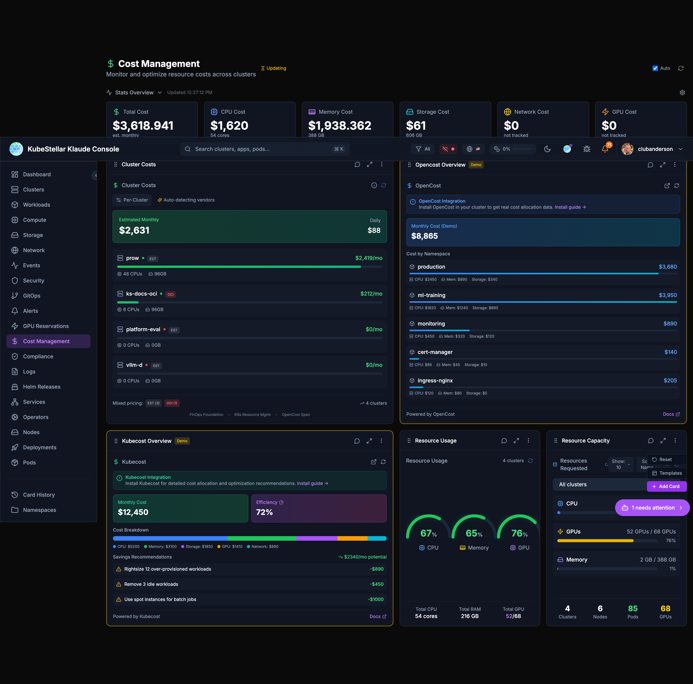

Track your spending:
- Total estimated cost
- Cost per cluster
- Cost by resource type (CPU, memory, storage)
- OpenCost and Kubecost integration

**Best for:** Controlling cloud spending

---

### Compliance Dashboard

**Route:** `/compliance`

Check compliance:
- Compliance score
- Passing and failing checks
- Critical findings
- Policy violations

**Best for:** Meeting security requirements

---

### Logs Dashboard

**Route:** `/logs`

View logs:
- Container logs from any pod
- Filter by namespace or pod
- Search log content

**Best for:** Debugging application issues

---

### Helm Releases Dashboard

**Route:** `/helm`

Manage Helm:
- All Helm releases
- Release history
- Values comparison
- Available upgrades

**Best for:** Managing Helm deployments

---

### Services Dashboard

**Route:** `/services`

See all services:
- ClusterIP services
- LoadBalancer services
- NodePort services
- Endpoints

**Best for:** Understanding service networking

---

### Operators Dashboard

**Route:** `/operators`

Manage operators:
- OLM operators
- Subscriptions
- Available updates

**Best for:** Managing cluster extensions

---

### Nodes Dashboard

**Route:** `/nodes`

See your nodes:
- Node health status
- Resource usage per node
- Node labels and taints

**Best for:** Infrastructure monitoring

---

### Deployments Dashboard

**Route:** `/deployments`

Focus on deployments:
- All deployments across clusters
- Replica counts
- Rollout status

**Best for:** Application deployment status

---

### Pods Dashboard

**Route:** `/pods`

Focus on pods:
- All pods across clusters
- Pod status
- Restart counts
- Resource usage

**Best for:** Detailed pod troubleshooting

---

### AI/ML Dashboard

**Route:** `/ai-ml`

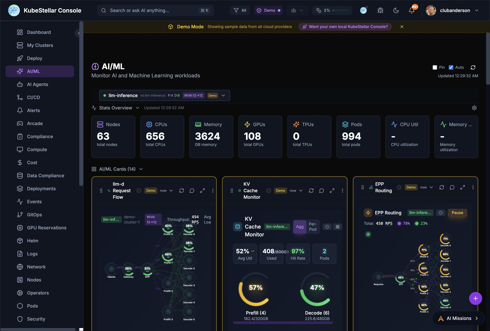

Monitor AI and Machine Learning workloads:
- llm-d inference stack monitoring (Request Flow, KV Cache, EPP Routing)
- Prefill/Decode disaggregation metrics
- llm-d benchmarks and comparisons
- ML Jobs and Notebooks
- GPU Overview with type breakdown
- Hardware Health monitoring
- Node Offline Detection with AI predictions

**Best for:** Managing AI/ML infrastructure and LLM serving stacks

---

### llm-d Benchmarks Dashboard

**Route:** `/llm-d-benchmarks`

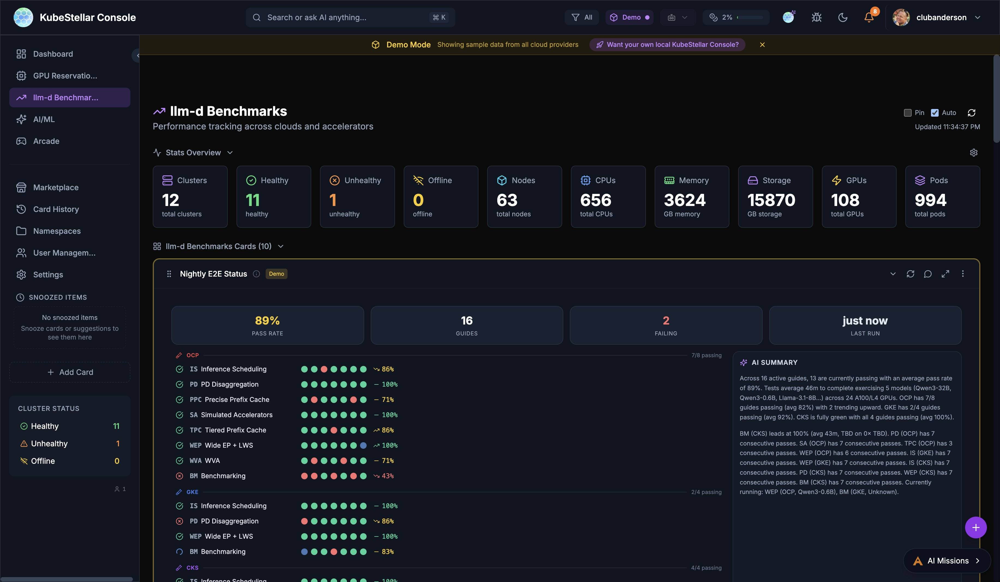

Performance tracking across clouds and accelerators for the llm-d inference stack:

- **Nightly E2E Status**: Real-time pass rates across 16 guides on OCP, GKE, and CKS platforms with per-guide green/red dot matrix and AI-generated summary
- **Pareto Frontier**: Tabbed chart views comparing throughput vs. latency tradeoffs across configurations
- **Leaderboard**: Ranked model/configuration comparison with pagination
- **Benchmark Hero**: Summary metrics from the latest benchmark runs
- **Live Data**: Streams benchmark results from Google Drive via SSE (Server-Sent Events) with automatic fallback to demo data

The Nightly E2E Status card features:
- 89% overall pass rate with 16 active guides
- Per-platform breakdown (OCP, GKE, CKS) with individual pass rates
- Sparkline trend graph showing pass rate over time
- AI summary with duration, model, and GPU information
- Detail panel with per-guide status and last run timestamps

**Best for:** Tracking llm-d inference stack performance and CI health across platforms

---

### AI Agents Dashboard

**Route:** `/ai-agents`

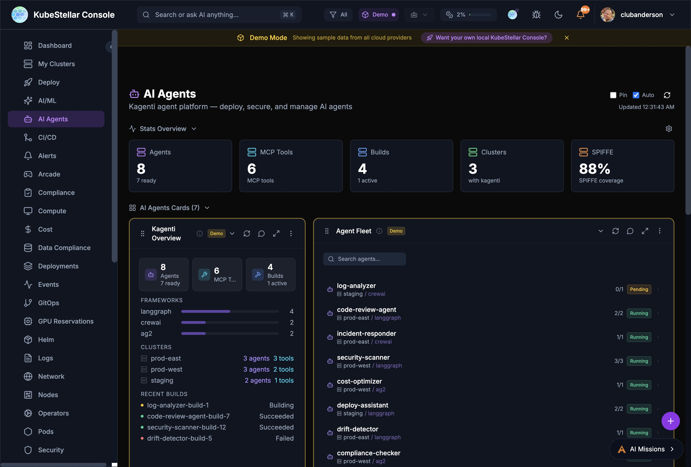

Manage Kagenti AI agents:
- Agent fleet overview across clusters
- MCP tools and framework breakdown (LangGraph, CrewAI, AG2)
- Agent build status and history
- SPIFFE identity coverage
- Per-agent replica status and cluster placement

**Best for:** Deploying, securing, and monitoring AI agents

---

### CI/CD Dashboard

**Route:** `/ci-cd`

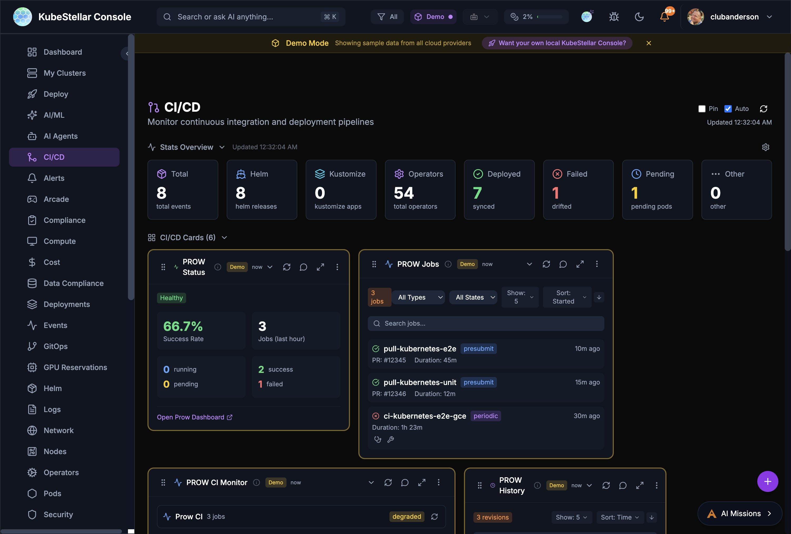

Monitor continuous integration and deployment:
- PROW CI status and success rates
- PROW Jobs with type/state filtering
- PROW revision history
- Helm release tracking
- Kustomize and ArgoCD sync status
- Operator deployments and synced counts

**Best for:** Monitoring CI/CD pipelines and PROW test infrastructure

---

### Deploy Dashboard

**Route:** `/deploy`

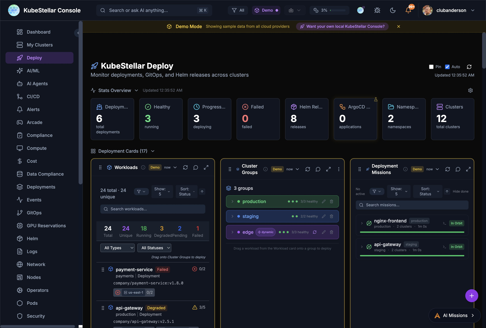

Multi-cluster deployment management:
- Workloads overview with drag-to-deploy
- Cluster Groups for targeting deployments
- Deployment Missions with AI-assisted rollouts
- Resource Marshall for workload placement
- Deployment history and rollback

**Best for:** Deploying and managing workloads across multiple clusters

---

### Data Compliance Dashboard

**Route:** `/data-compliance`

Monitor data compliance:
- Data classification status
- Compliance checks and violations
- Policy enforcement across clusters

**Best for:** Meeting data governance requirements

---

### Arcade Dashboard

**Route:** `/arcade`

Take a break with Kubernetes-themed games:
- 21 games including AI Checkers, Kube Chess, Container Tetris, Sudoku
- High scores saved locally
- Multiple themes available

**Best for:** Team building and having fun

---

### Marketplace Dashboard

**Route:** `/marketplace`

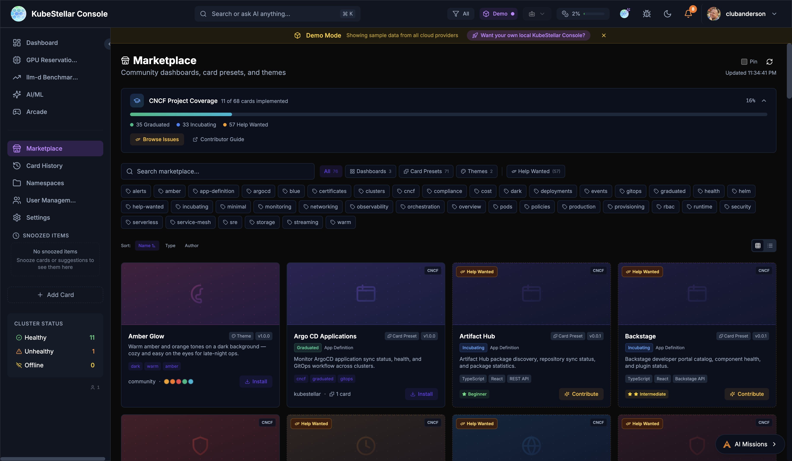

Community dashboards, card presets, and themes:
- Browse and install community-created dashboards (3+ available)
- Card Presets for common use cases (7+ presets)
- Theme marketplace with multiple visual styles (3+ themes)
- CNCF project coverage tracker: 11 of 68 cards implemented (16%), with 35 Graduated, 33 Incubating, and 57 Help Wanted
- Contributor Guide and Browse Issues links for community contribution
- Rich tag-based filtering: alerts, argocd, certificates, clusters, compliance, cncf, cost, deployments, events, gitops, graduated, health, helm, incubating, monitoring, networking, observability, orchestration, pods, policies, production, provisioning, rbac, runtime, security, serverless, service-mesh, sre, storage, streaming, warm
- Sort by Name, Type, or Author
- Grid and list view toggle

**Best for:** Extending your console with community content

---

## Utility Pages

These aren't counted as dashboards but are useful:

| Page | Route | What it does |
|------|-------|--------------|
| Card History | `/history` | See cards you've removed |
| Settings | `/settings` | Configure your preferences |
| User Management | `/users` | Manage users (admin only) |
| Namespaces | `/namespaces` | Manage namespace access |

---

## Tips

### Customizing Dashboards

Every dashboard can be customized:
1. Click "Add Card" to add new cards
2. Drag cards to rearrange them
3. Click the menu on any card to configure or remove it
4. Use the reset button to go back to defaults

### Stats Blocks

The stats at the top of each dashboard show the most important numbers. You can configure which stats appear by clicking "Configure stats".

### Auto-Refresh

All dashboards auto-refresh by default. You can:
- Toggle auto-refresh on/off
- Manually refresh with the refresh button
- See when data was last updated
