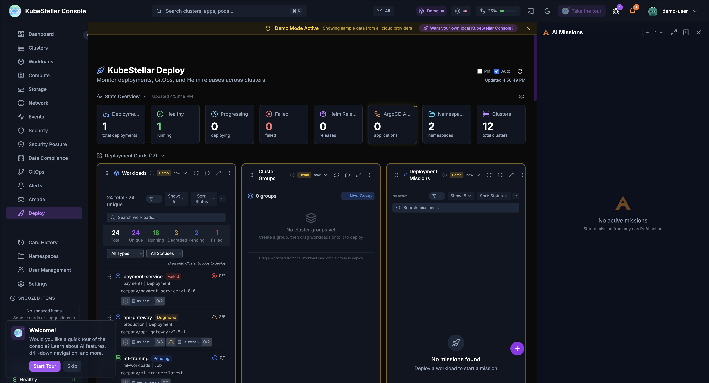
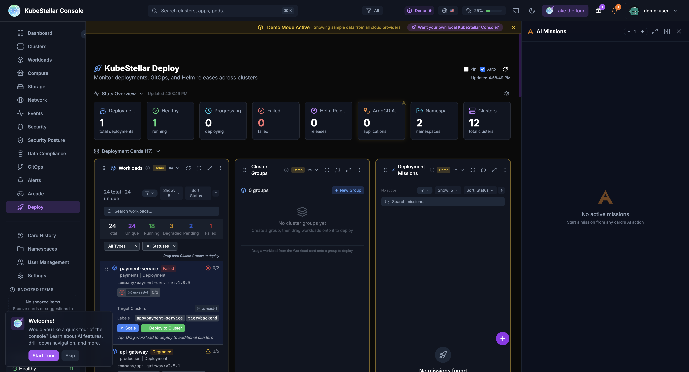

# Deploy & Orchestrate

KubeStellar Console isn't just for monitoring — it's a full deployment and orchestration control plane for your workloads across multiple clusters.

---

## What Can You Do?

From the **Deploy** dashboard, you can:

- **See all your workloads** across every cluster in one place
- **Create cluster groups** to organize where things run
- **Deploy workloads** by dragging them onto cluster groups
- **Track deployment missions** as AI helps you deploy
- **Monitor progress** with real-time status updates

Think of it like a control tower for your applications. You see everything, and you can move things around.

---

## The Three Panels

The Deploy dashboard has three main panels that work together:

### 1. Workloads

The left panel shows all your workloads across all clusters:

- **Total count** and **unique workloads**
- **Status breakdown** — Running, Stopped, Degraded, Pending, Failed
- **Filter and search** by type, status, or name
- **Click any workload** to see its details, containers, and deployment history

Each workload shows:
- Name and namespace
- Current status (with color coding)
- Which clusters it runs on
- Container count and resource usage

### 2. Cluster Groups

The middle panel lets you organize clusters into groups:

- **Create a group** — Click "+ New Group" and pick which clusters belong
- **Name your groups** — Like "production", "staging", "us-east", "gpu-nodes"
- **Drag and drop** — Drag a workload from the left panel onto a group to deploy it there

Cluster groups make it easy to deploy the same workload to multiple clusters at once. Instead of deploying to each cluster one by one, just drop it on the group.

### 3. Deployment Missions

The right panel tracks your deployment operations:

- **AI-assisted deployments** — AI helps plan and execute deployments
- **Mission status** — See what's deploying, what succeeded, what failed
- **History** — Review past deployments

---

## How to Deploy a Workload

### Step 1: Create a Cluster Group

1. Click **"+ New Group"** in the Cluster Groups panel
2. Give it a name (like "production-us")
3. Select which clusters belong to this group
4. Save the group

### Step 2: Drag a Workload

1. Find your workload in the Workloads panel
2. Drag it onto your cluster group
3. The console creates a deployment mission

### Step 3: AI Takes Over

1. AI analyzes the workload requirements
2. AI checks cluster capacity and compatibility
3. AI creates the deployment plan
4. You review and approve
5. Deployment happens across all clusters in the group

---

## Workload Details

Click any workload to see:

- **Deployment details** — Replicas, strategy, labels
- **Containers** — Images, ports, resource limits
- **Status across clusters** — Where it's running, where it's failing
- **Events** — Recent events related to this workload
- **AI Diagnose** — Ask AI what's wrong and how to fix it

---

## Stats at a Glance

The top of the Deploy dashboard shows key numbers:

| Stat | What it means |
|------|--------------|
| **Deployments** | Total deployments being managed |
| **Healthy** | Deployments running without issues |
| **Progressing** | Deployments currently rolling out |
| **Failed** | Deployments that need attention |
| **Helm Releases** | Helm-managed deployments |
| **ArgoCD Apps** | ArgoCD-managed applications |
| **Namespaces** | Namespaces in use |
| **Clusters** | Total clusters available |

---

## GitOps Integration

The Deploy dashboard also integrates with GitOps tools:

- **Helm releases** — See all Helm charts deployed across clusters
- **ArgoCD applications** — Monitor ArgoCD sync status
- **Kustomizations** — Track Kustomize-based deployments

This means you can use the console alongside your existing GitOps workflow, or as a standalone deployment tool.

---

## Why Use This?

### Before: One Cluster at a Time

Without the console, deploying to multiple clusters means:
1. Switch kubeconfig context
2. Run kubectl apply
3. Switch to next cluster
4. Repeat for every cluster
5. Hope nothing went wrong

### After: All Clusters at Once

With the console:
1. Create a cluster group
2. Drag your workload onto it
3. Done — AI handles the rest

---

## Tips

- **Start with groups** — Create cluster groups that match how you think about your infrastructure (by region, environment, or purpose)
- **Use AI** — Let AI diagnose failed deployments instead of digging through logs manually
- **Watch the missions** — The Deployment Missions panel shows you exactly what's happening
- **Filter workloads** — Use the status filters to focus on what needs attention (Failed, Degraded, Pending)
