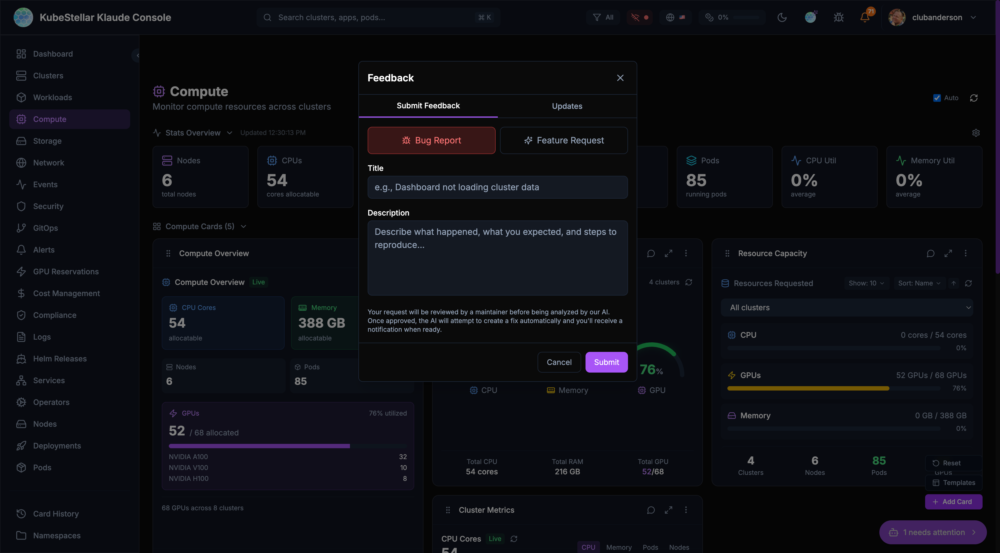

# Feedback System

KubeStellar Console has a unique feedback system. When you report a bug or request a feature, AI helps create the fix automatically!



---

## How It Works

This is a **closed-loop** system:

```
You report → Maintainer reviews → AI creates fix → You test → Release!
```

### The Process

1. **You submit** - Describe the bug or feature
2. **Maintainer triages** - Reviews and approves
3. **AI analyzes** - Figures out what needs to change
4. **AI creates PR** - Makes the code changes
5. **You get notified** - When a fix is ready
6. **You test** - Try the preview deployment
7. **You approve** - Provide feedback
8. **Release** - Goes into next version

---

## Bug-to-Squash

When something doesn't work right, report it!

### How to Report a Bug

1. Click **"Report a bug or request a feature"** (top bar)
2. Select **"Bug Report"** tab
3. Fill in:
   - **Title** - Short description
   - **Description** - What happened, what you expected, steps to reproduce
4. Click **Submit**

### What Happens Next

| Status | Meaning |
|--------|---------|
| **Open** | Submitted, waiting for review |
| **Needs Triage** | Maintainer is reviewing |
| **Triage Accepted** | Approved for AI fix |
| **Feasibility Study** | AI analyzing the problem |
| **Fix Ready** | AI created a fix, needs testing |
| **Fix Complete** | You approved, going to release |
| **Unable to Fix** | Couldn't be fixed automatically |
| **Closed** | Issue resolved or won't fix |

### Getting Notified

You'll receive notifications when:
- Your bug is accepted for triage
- A fix is ready for testing
- The fix is released

Check the bell icon in the header for notifications.

---

## Feature-to-Fulfillment

Have an idea? Request it!

### How to Request a Feature

1. Click **"Report a bug or request a feature"** (top bar)
2. Select **"Feature Request"** tab
3. Fill in:
   - **Title** - What feature you want
   - **Description** - How it should work, why you need it
4. Click **Submit**

### Good Feature Requests

**Do:**
- Be specific about what you want
- Explain why it's useful
- Give examples of how you'd use it

**Don't:**
- Be vague ("make it better")
- Request huge changes
- Duplicate existing features

### Example

**Good:** "Add a dark mode toggle in settings so I can reduce eye strain at night"

**Not as good:** "The UI needs improvement"

---

## Tracking Your Requests

### View Your Submissions

1. Click **"Report a bug or request a feature"**
2. Select **"Updates"** tab
3. See all your submissions and their status

### Request Statuses

```
open → needs_triage → triage_accepted → feasibility_study → fix_ready → fix_complete
                                    ↘ unable_to_fix
```

---

## Testing Fixes

When a fix is ready, you can test it!

### Preview Deployments

For each fix, a preview deployment is created. You'll get a link to test the fix in a temporary environment.

### Providing Feedback

After testing:
- **Positive** - The fix works! Click 👍
- **Negative** - Something's still wrong. Click 👎 and explain

Your feedback helps improve the fix before it ships.

---

## Why This Is Special

### AI-Maintained Repository

KubeStellar Console is one of the first codebases that is **continuously maintained by AI**:

- **Closed-loop** - Your feedback directly creates code changes. Report a bug, get a fix. Request a feature, get it built.
- **Fast** - Fixes can be created in hours, not weeks
- **Quality-checked** - Every AI-generated fix goes through automated tests, code review, and human approval
- **Always improving** - The console is being developed all day, every day, with AI writing and reviewing code around the clock

### How the Automation Works

Behind the scenes, a pipeline of AI agents handles your requests:

1. **Auto-QA** scans the codebase for issues every hour
2. **Copilot coding agent** creates pull requests to fix issues
3. **Copilot review agent** reviews every PR for quality
4. **Auto-apply** ensures review suggestions are incorporated
5. **Automated testing** validates every change
6. **Human maintainers** approve and merge

This means bugs get caught early, fixes get reviewed automatically, and releases happen frequently.

### Human + AI

Humans still:
- Review and approve changes
- Make architecture decisions
- Handle complex changes
- Ensure quality

AI helps with:
- Analyzing problems
- Creating initial fixes
- Running tests
- Reviewing code
- Generating documentation

---

## GitHub Integration

Behind the scenes, your requests become GitHub issues:

1. You submit a request
2. Console creates a GitHub issue
3. GitHub Actions trigger AI analysis
4. AI creates a Pull Request
5. Maintainers review
6. Tests run automatically
7. Merge and deploy

You don't need to know any of this - it just works!

---

## Tips

### For Bug Reports

- Include screenshots if helpful
- Mention which page/card had the issue
- Note your browser and OS
- Describe recent actions before the bug

### For Feature Requests

- Check if the feature already exists
- Be patient - complex features take time
- Provide examples from other tools
- Explain the problem you're solving

### General

- Be kind - there are humans and AI working to help
- Be specific - vague requests are hard to fix
- Test thoroughly - good testing means better releases
