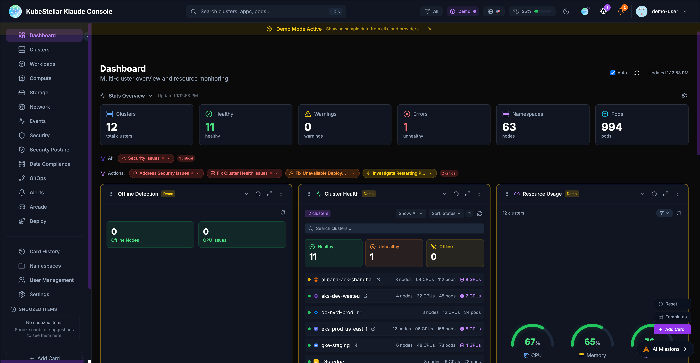
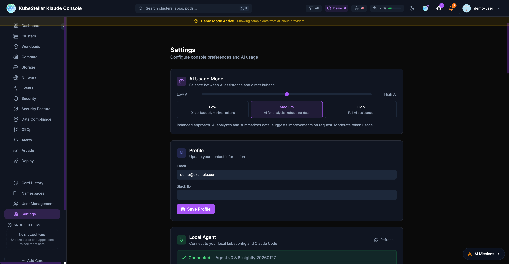
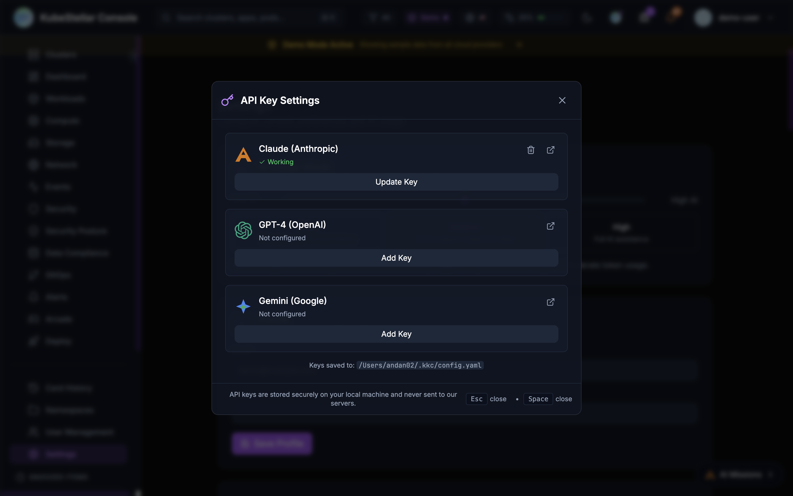
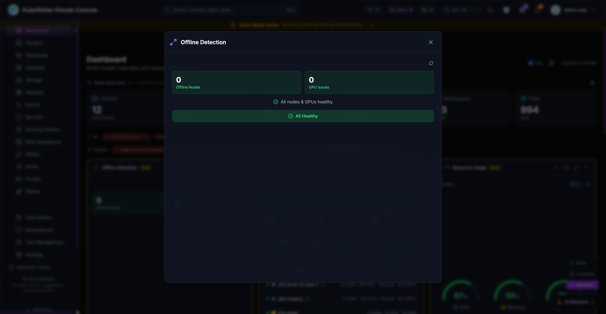
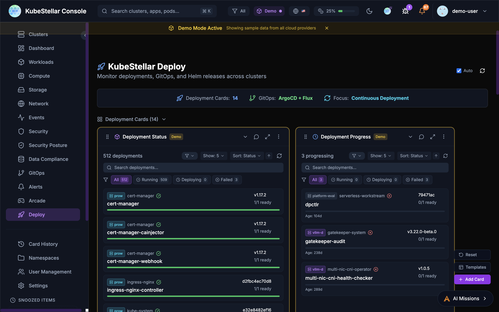

# Klaude Console Features

This guide covers the main features of the KubeStellar Klaude Console.

## Dashboard

The main dashboard provides a customizable view of your multi-cluster environment.

### Stats Overview

The stats bar at the top of the dashboard displays key metrics:

- **Clusters**: Total cluster count and health status
- **Nodes**: Total nodes across all clusters
- **Pods**: Total pod count with status breakdown
- **AI Insights**: Security issues and recommended actions

### Dashboard Cards

Cards are the building blocks of the dashboard. Each card displays specific information about your clusters:

- Drag cards to reorder them
- Resize cards by adjusting their width
- Collapse cards to save space
- Use the AI button to get insights about card data

### Dashboard Templates

Pre-configured dashboard layouts for common use cases:

- **Operations**: Cluster health, deployments, events
- **GPU Monitoring**: GPU utilization, workloads, trends
- **Security**: OPA policies, alerts, vulnerabilities
- **GitOps**: Helm releases, drift detection, sync status

## Settings

The settings page allows you to configure all aspects of the console.

### AI Usage Mode

Control how much AI assistance you receive:

- **Low**: Direct kubectl commands, minimal token usage
- **Medium**: AI for analysis and suggestions
- **High**: Full AI assistance for all operations

### Local Agent

Connect to your local kubeconfig and Claude Code:

- View agent version and connection status
- See connected clusters
- Monitor token usage (session, daily, monthly)

### Update Channels

Choose your release channel:

- **Stable (Weekly)**: Tested releases every week
- **Nightly**: Latest features, updated daily

### Appearance

Customize the look and feel:

- Multiple themes: KubeStellar, Batman, Dracula, Nord, Tokyo Night, Cyberpunk, Matrix
- Visual effects: star field, glow effects, gradients
- Accessibility: color blind mode, reduce motion, high contrast

### Token Usage

Monitor and limit AI token consumption:

- Set monthly token limits
- Configure warning and critical thresholds
- Reset usage counters

## Navigation

The sidebar provides access to all major sections:

### Primary Navigation

- **Dashboard**: Main multi-cluster overview
- **Clusters**: Detailed cluster management
- **Workloads**: Deployments, pods, and jobs
- **Compute**: CPU, memory, and GPU resources
- **Storage**: Persistent volumes and claims
- **Network**: Services, ingresses, and network policies
- **Events**: Kubernetes event stream
- **Security**: Security posture and alerts
- **GitOps**: Helm, Kustomize, and ArgoCD

### Secondary Navigation

- **Card History**: Previously viewed cards
- **Namespaces**: Namespace-specific views
- **User Management**: RBAC and access control
- **Settings**: Console configuration

### Special Sections

- **Arcade**: Games and entertainment
- **Deploy**: Multi-cluster deployment tools

## Search

The global search bar (`Cmd/Ctrl + K`) enables quick navigation:

- Search clusters by name
- Find applications and pods
- Navigate to specific namespaces
- Filter by resource type

## Alerts

The alert system keeps you informed:

- Real-time notifications for critical events
- Configurable alert rules
- Integration with external notification systems
- Alert history and acknowledgment

## AI Missions

AI-powered automation for common tasks:

### Starting a Mission

Missions can be started from:

- **Card AI buttons**: Click the AI icon on any card
- **Stats bar actions**: Click "Address Security Issues" or similar action buttons
- **Keyboard shortcut**: Press `M` to open the missions panel

### Mission Types

- **Security Analysis**: Investigate security issues and vulnerabilities
- **Performance Investigation**: Analyze slow pods or resource constraints
- **Troubleshooting**: Debug failing deployments or pods
- **Remediation**: Apply fixes for common problems

### AI Provider Configuration

The console supports multiple AI backends:

- **Claude (Anthropic)**: Primary AI backend with API access
- **Claude Code (Local)**: Uses your local Claude Code installation for missions
- **GPT-4 (OpenAI)**: Alternative LLM backend
- **Gemini (Google)**: Alternative LLM backend

Configure API keys in Settings > AI Provider Keys or click the key icon in the header.

## Offline Detection

The Offline Detection card monitors node and GPU health:

### Features

- **Node Monitoring**: Detects nodes with NotReady status
- **GPU Tracking**: Identifies GPU nodes reporting 0 available GPUs
- **Health Summary**: Shows count of offline nodes and GPU issues
- **AI Analysis**: Click "Analyze Issues" to start an AI mission investigating problems

### Status Indicators

- **All Healthy**: Green status when no issues detected
- **Issues Found**: Red/orange status with counts of affected resources
- **Drill-Down**: Click counts to navigate to affected resources

## Deploy Page

The Deploy page provides tools for managing deployments across clusters.

### Deployment Cards

- **Deployment Status**: Overview of all deployments
- **Deployment Progress**: Track rollout progress
- **Deployment Issues**: View failing deployments

### GitOps Integration

- **GitOps Drift**: Detect configuration drift from Git
- **ArgoCD Applications**: Manage ArgoCD apps across clusters
- **ArgoCD Sync Status**: Monitor sync state
- **ArgoCD Health**: Application health dashboard

### Helm Management

- **Helm Release Status**: View deployed releases
- **Helm History**: Track release revisions
- **Helm Chart Versions**: Monitor chart updates

### Kustomize

- **Kustomization Status**: Monitor Flux kustomizations
- **Overlay Comparison**: Compare environment overlays

### Workload Deployment

Deploy workloads across clusters with drag-and-drop:

1. Select a workload type (Deployment, StatefulSet, Job)
2. Drag to target clusters on the world map
3. Configure namespace and replicas
4. Preview changes before applying
