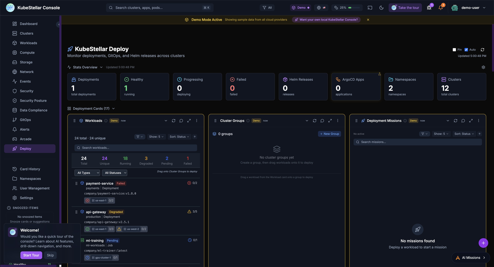

# KubeStellar Console

**Your clusters, your way - AI that learns how you work**


## What is it?

KubeStellar Console is like a smart control room for all your Kubernetes clusters. Think of it as a dashboard that:

- Shows you everything happening across all your clusters in one place
- Learns what you care about and shows you that first
- Helps you fix problems using AI (like having a helpful assistant)
- Lets you create your own cards using AI or JSON
- Lets you report bugs and request features that get fixed automatically

## Why is it special?

This is one of the first projects where **AI helps maintain itself**. When you report a bug or request a feature:

1. You describe what you want
2. AI reviews it and creates a fix
3. You get a preview to test
4. Once approved, it goes into the next release

It's a closed-loop system - your feedback directly improves the product!

## Quick Numbers

| What | Count |
|------|-------|
| Dashboard Pages | 20+ |
| Card Types | 110+ |
| Stats Blocks | 93+ |

## Main Features

### Dashboards for Everything

20+ dashboards, each focused on a specific area:

- **Main Dashboard** - Your personalized home view
- **Clusters** - Health and status of all clusters
- **Workloads** - Deployments, pods, services
- **Compute** - CPUs, memory, GPUs
- **Storage** - Volumes and storage classes
- **Network** - Services and ingresses
- **Security** - Issues and vulnerabilities
- **GitOps** - Helm releases and Kustomizations
- **Alerts** - Active alerts and rules
- **Cost** - Money tracking for your resources
- And more specialized views!

[See all dashboards](dashboards.md)

### Smart Cards

110+ card types you can add to any dashboard:

- Cluster health checks
- Resource usage gauges
- Event streams
- GPU monitoring
- Cost tracking
- Security and compliance scores
- Workload deep-dives
- Provider health (AI and cloud)
- And many more!

[See all cards](all-cards.md)

### Deploy & Orchestrate

The console is a full deployment control plane. From the Deploy dashboard you can:

- See all workloads across every cluster
- Create cluster groups (like "production" or "us-east")
- Deploy workloads by dragging them onto groups
- Let AI plan and execute multi-cluster deployments
- Track deployment missions in real time



[Learn about Deploy & Orchestrate](deploy.md)

### Card Factory - Build Your Own

You can create your own cards in two ways:

- **AI-Assisted** - Describe what you want in plain English, and AI builds the card for you
- **JSON or Code** - Write a card definition in JSON or TSX and the Card Factory brings it to life

This means the console grows with your needs. If a card doesn't exist, just make one!

### Stats at a Glance

93+ stats blocks that show you important numbers instantly:

- Cluster counts
- Pod status
- Resource usage
- Alert counts
- Cost summaries
- Compliance scores

[See all stats blocks](stats-blocks.md)

### AI That Helps

- **AI Missions** - Chat with AI to troubleshoot problems
- **Diagnose & Repair** - AI finds what's wrong and suggests fixes
- **Smart Suggestions** - AI notices what you're looking at and suggests better cards
- **AI Card Creation** - Describe a card and AI builds it for you


[Learn about AI features](ai-features.md)

### Report Bugs, Get Fixes

The bug-to-squash workflow:

1. Click "Report a bug"
2. Describe the problem
3. AI creates a fix
4. You get a notification when it's ready
5. Test and approve

The same works for feature requests - describe what you want and AI builds it.

[Learn about the feedback system](feedback.md)

### Alerts You Control

- Set up alerts for things you care about
- Choose how you want to be notified (browser, Slack, webhook)
- Let AI diagnose alerts for you
- Track token usage to control costs


[Learn about alerts](alerts.md)

### Security and Compliance

- See security issues across all clusters
- Compliance scoring (CIS, NSA, PCI frameworks)
- RBAC analysis
- Privileged container detection


## How to Get Started

### Try the Live Preview (No Installation)

See it running at [console.kubestellar.io](https://console.kubestellar.io) - it starts in demo mode with sample data so you can explore everything.

### Run Locally

```bash
# Clone the repo
git clone https://github.com/kubestellar/console.git
cd console

# Start everything
./dev.sh
```

Open http://localhost:5174 and sign in with GitHub.

> **Note**: You'll need kubestellar-mcp plugins installed. See [Installation](installation.md) for the full setup with all 6 components.

### Run in Kubernetes

```bash
# Create secrets
# NOTE: Do not put real secrets directly in commands or commit them to git.
# Prefer environment variables or a secrets file (e.g. --from-env-file) that is not version-controlled.
kubectl create namespace ksc
kubectl create secret generic ksc-secrets \
  --namespace ksc \
  --from-literal=github-client-id="$GITHUB_CLIENT_ID" \
  --from-literal=github-client-secret="$GITHUB_CLIENT_SECRET"

# Install with Helm
helm install ksc oci://ghcr.io/kubestellar/charts/console \
  --namespace ksc \
  --set github.existingSecret=ksc-secrets
```

[Full installation guide](installation.md)

## It's Safe

- **You control your data** - The console uses an agent to proxy your kubeconfig, so you only see what you have access to
- **Works for teams** - Multiple people can use the same console without seeing each other's stuff
- **No interference** - Your dashboards, cards, and settings are personal to you
- **Shared SaaS, personal experience** - Everyone gets their own view on the same website

## Quick Links

- [Quick Start](quickstart.md) - Get running fast
- [Installation](installation.md) - All deployment options
- [Deploy & Orchestrate](deploy.md) - Multi-cluster deployment control plane
- [Dashboards](dashboards.md) - All dashboards
- [Cards](all-cards.md) - All 110+ cards
- [Stats Blocks](stats-blocks.md) - All 93+ stats
- [AI Features](ai-features.md) - Missions, diagnose, repair, card creation
- [Feedback System](feedback.md) - Bug-to-squash workflow
- [Alerts](alerts.md) - Notifications and token usage
- [Architecture](architecture.md) - How it works
- [Configuration](configuration.md) - Settings and options

## Source Code

- **Repository**: [kubestellar/console](https://github.com/kubestellar/console)
- **Container Image**: `ghcr.io/kubestellar/console`
