# Galaxy Marketplace

## 1. Introduction

Galaxy Marketplace is the official plugin ecosystem for **KubeStellar**, enabling users to extend platform functionality through modular, installable plugins. It functions similarly to an app store, streamlining the process of discovering, installing, and managing extensions for your Kubernetes environment.

### Key Benefits

- **Extensibility**: Easily add new capabilities to your KubeStellar platform.
- **Security**: Access safe, verified, and community-reviewed plugins.
- **Ecosystem**: Leverage a community-driven library of tools.
- **Simplicity**: One-click installation and automated updates.

---

## 2. Prerequisites

Before using the Galaxy Marketplace, ensure you have:

- Access to the KubeStellar UI.
- An active internet connection (for fetching plugin data).
- **Cluster Admin** privileges (required for installing plugins that modify cluster state).
- **Marketplace Admin** privileges (required only for uploading or approving plugins).
- Basic understanding of Kubernetes resources and Helm charts (helpful but not required).

---

## 3. Feature Overview

The Galaxy Marketplace supports the full plugin lifecycle:

1.  **Discovery**: robust search, categorization, and filtering.
2.  **Installation**: automated dependency checking and deployment.
3.  **Management**: configuration, enabling/disabling, and removal.
4.  **Updates**: seamless version upgrades with changelogs.
5.  **Feedback**: user ratings and reviews.
6.  **Administration**: workflows for publishing and moderating plugins.

---

## 4. Marketplace Interface

### Layout

The marketplace user interface is designed for intuitive navigation:

- **Hero Section**: Highlights featured plugins and provides a prominent search bar.
- **Sidebar Navigation**: Allows quick filtering by category (e.g., Security, Monitoring).
- **Plugin Grid**: Displays plugins as cards with key metrics.

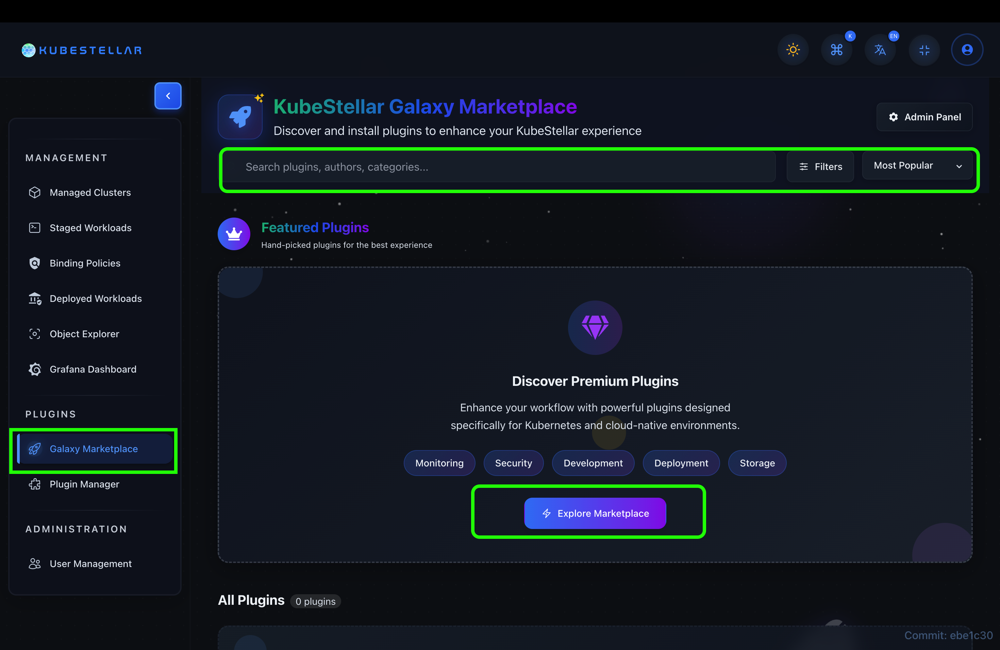

> **Figure 1: Marketplace Home Page**
>
> 1. **Hero Search:** Quick lookup by name or keyword.
> 2. **Featured Carousel:** Curated list of top plugins.
> 3. **Categories:** Filter by domain like AI/ML or Networking.
> 4. **Plugin Grid:** Browse available plugins.

### Plugin Card

Each plugin card provides a snapshot of importance:

- **Identity**: Icon and Official Name.
- **Metadata**: Publisher, Version, and Star Rating.
- **Metrics**: Total Downloads.
- **Action**: "Install" (or "Manage") button.

---

## 5. Plugin Discovery

### Search Functionality

Find exactly what you need using robust search capabilities:

- **Keywords**: Match against plugin name, description, and tags.
- **Author**: Search plugins by specific publishers.
- **Real-time Results**: Instant feedback as you type.


### Categories

Browse plugins organized by domain:

- **Monitoring & Observability** (Prometheus, Grafana)
- **Security & Compliance** (Scanners, Policy Managers)
- **Networking** (Ingress Controllers, Service Mesh)
- **Storage** (CSI Drivers)
- **CI/CD & DevOps** (Pipelines, GitOps)
- **Databases** (SQL/NoSQL Operators)
- **AI/ML** (Model Serving, Training Jobs)
- **Utilities** (General purpose tools)

### Advanced Filtering & Sorting

- **Sort By**: Relevance, Popularity (Downloads), Rating, or Newest.
- **Filters**: Minimum Rating (4+ Stars), Verified Publisher, Compatible Version.

---

## 6. Plugin Details View

Clicking a plugin card opens the detailed view, providing all information needed effectively.

### Overview Tab

- **Header**: High-resolution icon, aggregate rating, and publisher links.
- **Description**: Full Markdown-supported README detailing features and usage.
- **Quick Stats**: License type, size, version history, and support links.
- **Tags**: Clickable keywords for finding similar tools.

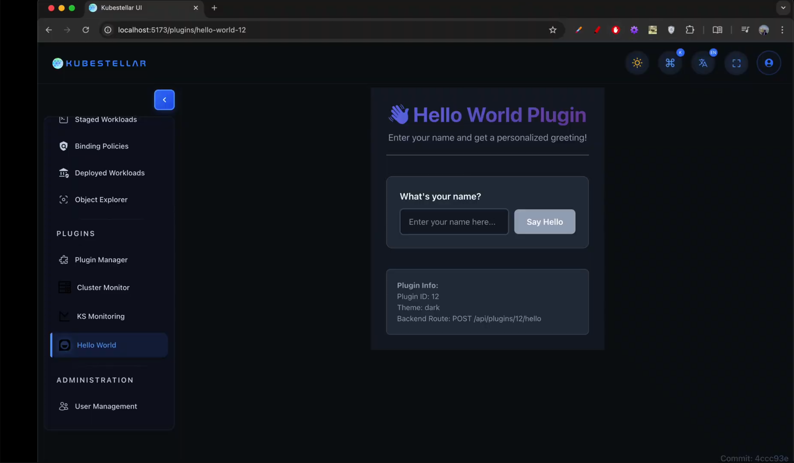

### Gallery & Media

- **Screenshots**: High-quality UI previews.
- **Videos**: Embedded demos or tutorials.
- **Diagrams**: Architecture visualizations.

### Ratings & Reviews

- **Distribution**: Histogram of 1-5 star ratings.
- **User Reviews**: Written feedback from the community, sortable by helpfulness.
- **Developer Replies**: Direct responses from plugin authors.

### Changelog & Dependencies

- **Changelog**: Detailed history of changes, fixes, and features per version.
- **Dependencies**: Lists required KubeStellar versions or other plugin prerequisites.

---

## 7. Plugin Installation

### Installation Flow

1.  **Initiate**: Click the **Install** button.
2.  **Review**: Check the confirmation dialog for:
    - Requested Permissions (RBAC).
    - Required Dependencies.
    - Terms of Service.
3.  **Confirm**: Click "Install" to proceed.
4.  **monitor**: Watch the progress bar (Downloading -> Installing -> Configuring).

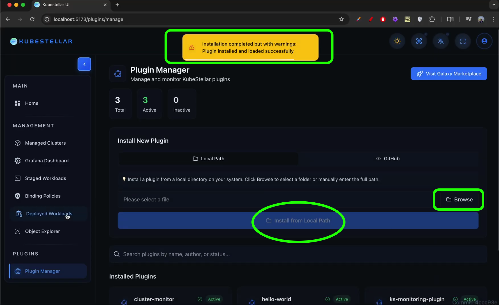

### Installation Options

- **Version Selection**: Choose a specific version (defaults to latest).
- **Auto-Update**: Toggle to automatically apply future patches.
- **Custom Configuration**: Provide specific values (Helm values) during install.

---

## 8. Plugin Management

### My Plugins Dashboard

A centralized view for all your installed extensions.

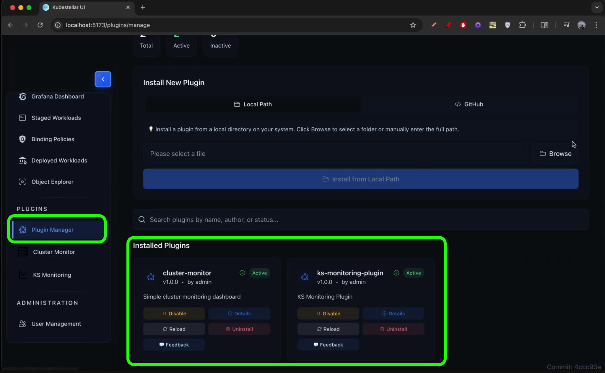

> **Figure 6: My Plugins Management**
>
> 1.  **Status**: 🟢 Active, 🔴 Error, 🔵 Updating, ⚪ Disabled.
> 2.  **Controls**: Enable/Disable toggle, Configure (Gear icon), Uninstall (Trash icon).

### Configuration

Access settings for active plugins to:

- Modify runtime parameters.
- Update API keys or secrets.
- Adjust resource limits.

### Updates

- **Notifications**: Badges appear when new versions are available.
- **Process**: Review changelog -> Click Update -> specific version is applied.

---

## 9. Plugin Upload (Admin Only)

Administrators can expand the marketplace by uploading new plugins.

### Upload Requirements

- **Format**: `.tar.gz` archive.
- **Contents**: Must include `plugin.yaml` (manifest), `README.md`, License, Icon, and binary/charts.
- **Size**: Max 100MB (default).

### Process

1.  Navigate to **Upload Plugin**.
2.  Drag & drop the bundle.
3.  System performs **Automatic Validation** (Schema check, Security scan).
4.  Fill in metadata (Categories, Tags).
5.  Submit. (If moderation is enabled, it enters a "Pending" state).

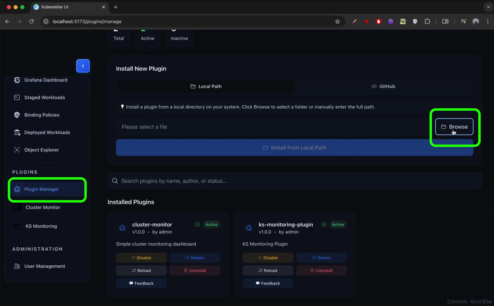
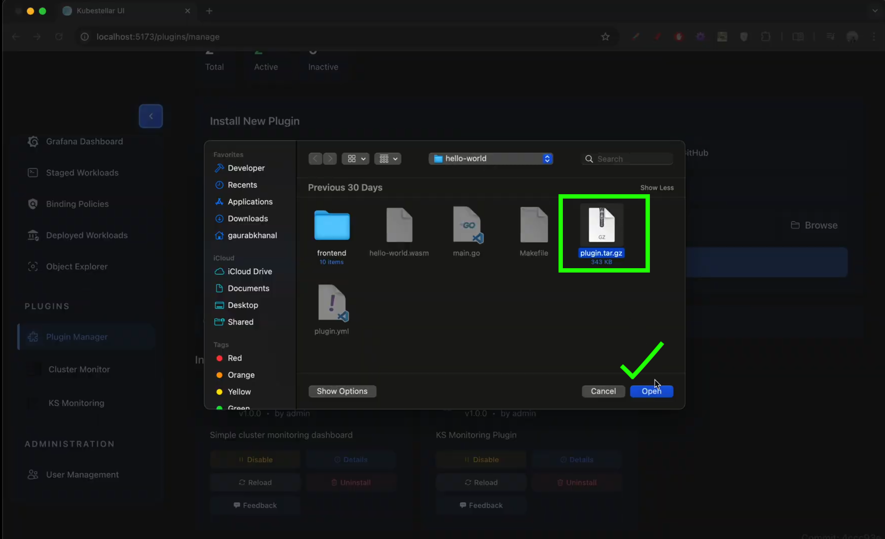

---

## 10. Admin Features

### Dashboard

Overview of ecosystem health:

- **Stats**: Total Downloads, Active Users, Plugin Count.
- **Moderation Queue**: Pending plugin approvals.

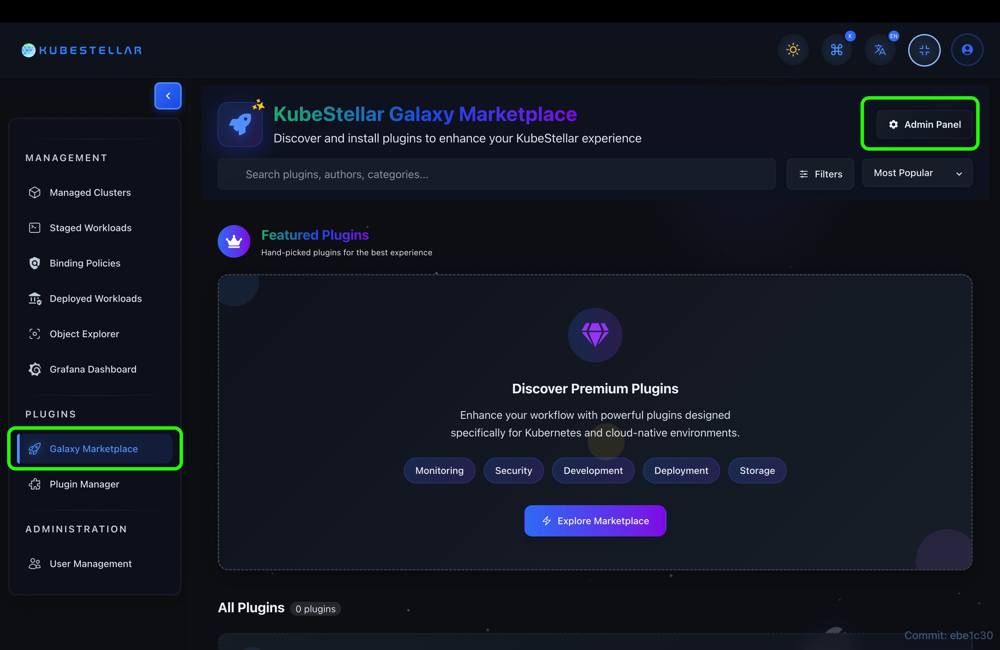
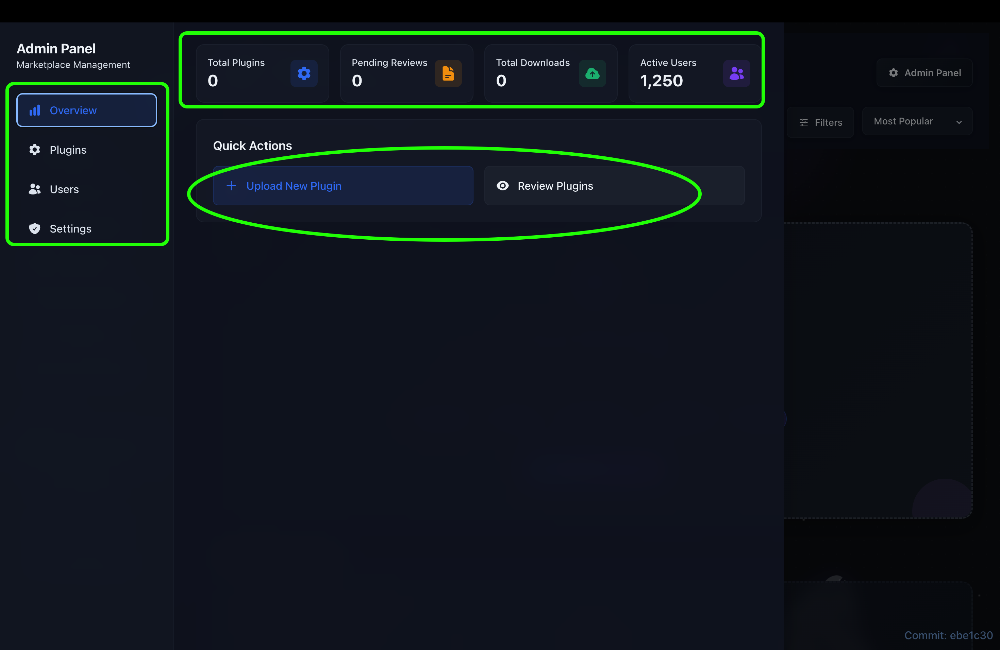
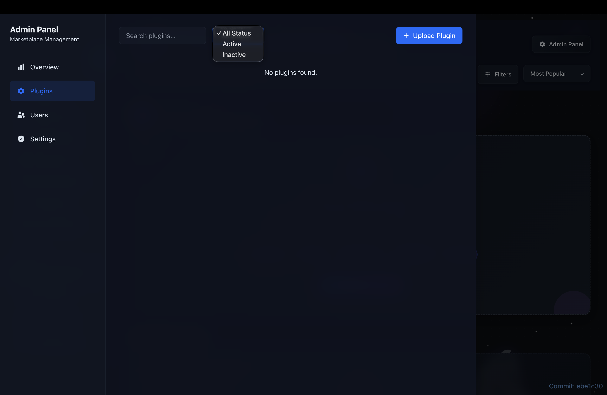

### Management Tools

- **Moderation**: Approve, Reject, or Request Changes on submissions.
- **Curating**: Feature plugins on the homepage carousel.
- **User Management**: Ban malicious publishers or grant "Verified" status.

---

## 11. System Diagrams

### Marketplace Architecture

Understanding how the components interact.

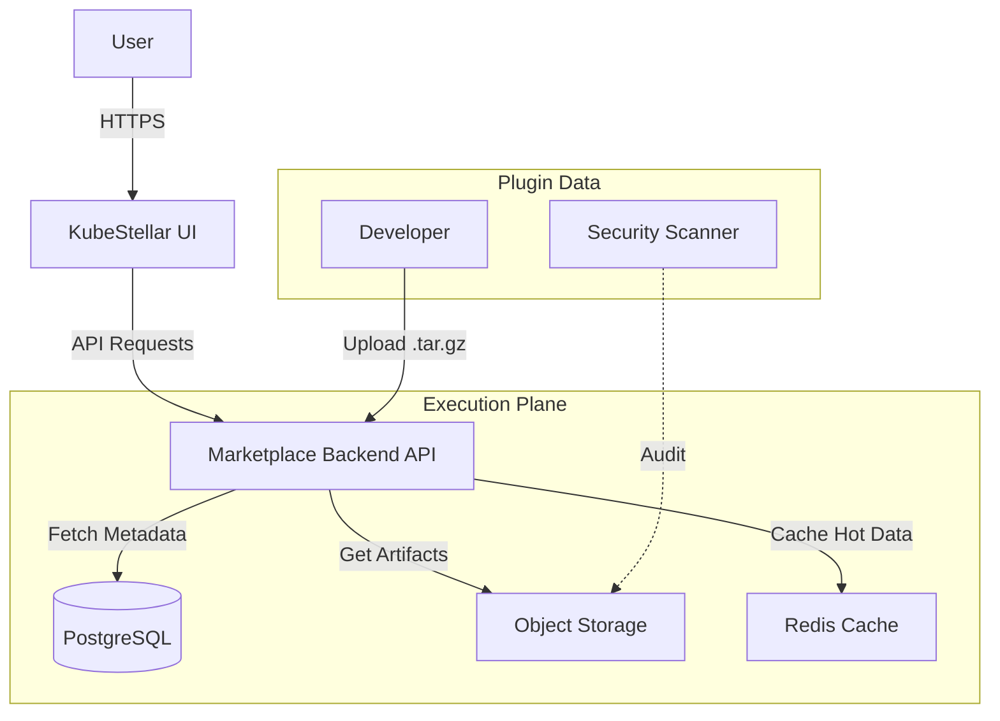

### Plugin Lifecycle

The state machine of a plugin within the user's environment.

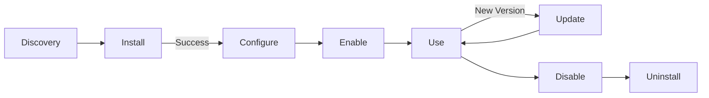

---

## 12. Step-by-Step Guides

### User Guides

1.  **Browsing**: Use the sidebar categories or "Featured" section to explore.
2.  **Searching**: Type keywords in the global search bar; use filters to narrow results.
3.  **Installing**: Click "Install", review permissions in the modal, and confirm.
4.  **Rating**: Go to the "Details" tab of an installed plugin and select a star rating.
5.  **Updating**: specific In "My Plugins", look for the blue update arrow and click it.
6.  **Uninstalling**: Click the trash icon in "My Plugins" and confirm removal.
7.  **Configuring**: Click the gear icon to open the settings form for a plugin.
8.  **Disabling**: Use the toggle switch to turn off a plugin without deleting data.
9.  **Viewing Logs**: Access the "Logs" tab in plugin details for debugging.

### Admin Guides

10. **Uploading**: Drag your `.tar.gz` to the upload area and wait for validation.
11. **Approving**: In "Pending Queue", review the manifest and click "Approve".
12. **Featuring**: Toggle the "Featured" star icon on any plugin in the admin list.

---

## 13. Use Cases

1.  **Observability Stack**:

    - _Scenario_: User wants to monitor cluster health.
    - _Action_: Installs "Prometheus Bundle" and "Grafana Widget".
    - _Result_: Instant metrics dashboards in KubeStellar.

2.  **Security Compliance**:

    - _Scenario_: Admin needs to ensure all namespaces follow policy.
    - _Action_: Installs "Kyverno Policy Manager".
    - _Result_: Automated policy enforcement and reporting.

3.  **Custom Dashboarding**:

    - _Scenario_: Developer wants a custom view for their app.
    - _Action_: Installs "Simple HTML Widget" plugin.
    - _Result_: A new tab appears in the dashboard with their custom content.

4.  **Developer Publishing**:

    - _Scenario_: Partner wants to distribute their tool.
    - _Action_: Packages tool as `.tar.gz` and uploads to Marketplace.
    - _Result_: Tool becomes available to all KubeStellar users.

5.  **Air-Gapped Installation**:
    - _Scenario_: Environment has no internet.
    - _Action_: Admin uploads "Offline Bundle" plugin manually.
    - _Result_: Plugins work without external connectivity.

---

## 14. API Reference

### Key Endpoints

| Method | Endpoint               | Description                        |
| :----- | :--------------------- | :--------------------------------- |
| `GET`  | `/api/v1/plugins`      | List all plugins with pagination.  |
| `GET`  | `/api/v1/plugins/{id}` | Get details for a specific plugin. |
| `POST` | `/api/v1/install/{id}` | Trigger installation workflow.     |
| `POST` | `/api/v1/upload`       | (Admin) Upload plugin bundle.      |

### Plugin Manifest Specification (`plugin.yaml`)

Developers must strictly follow this schema:

```yaml
apiVersion: marketplace.kubestellar.io/v1alpha1
kind: Plugin
metadata:
  name: my-awesome-plugin
  version: "1.2.0"
spec:
  title: "My Awesome Plugin"
  description: "Does amazing things."
  publisher: "TechCorp"
  icon: "icon.png"
  category: "Utilities"
  permissions:
    - apiGroups: [""]
      resources: ["pods"]
      verbs: ["get", "list"]
```

---

## 15. Troubleshooting

Common issues and how to resolve them.

### 1. Installation Fails

- **Cause**: Network timeout or insufficient permissions.
- **Solution**: Check internet connection and ensure your user role allows installation.

### 2. Plugin Not Appearing

- **Cause**: Browser or API caching.
- **Solution**: Hard refresh the page or clear browser cache.

### 3. Validation Error on Upload

- **Cause**: `plugin.yaml` syntax error.
- **Solution**: Validate your YAML against the schema in the API Reference.

### 4. Update Stuck

- **Cause**: A resource is locked by another process.
- **Solution**: Restart the KubeStellar agent or manually delete the pending pod.

### 5. Upload Rejected (Security)

- **Cause**: Binary contains restricted patterns.
- **Solution**: Review the security report and remove unsafe code.

### 6. Configuration Not Saved

- **Cause**: Input validation failed.
- **Solution**: Ensure all required fields are filled and match expected formats (e.g., valid email).

### 7. Dependency Conflict

- **Cause**: Incompatible with another installed plugin.
- **Solution**: Remove the conflicting plugin or check for a compatible version.

### 8. Slow Download Speed

- **Cause**: Network congestion or large asset size.
- **Solution**: Retry later or download the artifact manually if supported.

### 9. UI Blank/Crash

- **Cause**: Corrupted local storage state.
- **Solution**: Clear Local Storage for the domain in Developer Tools.

### 10. Admin Upload Button Missing

- **Cause**: Insufficient privileges.
- **Solution**: Log out and log in with an account holding the `market_admin` role.

---

## 16. Related Features

- **RBAC System**: Understanding user roles for installation permissions.
- **Cluster Management**: How plugins interact with connected clusters.
- **Audit Logs**: Tracking who installed or updated plugins.
